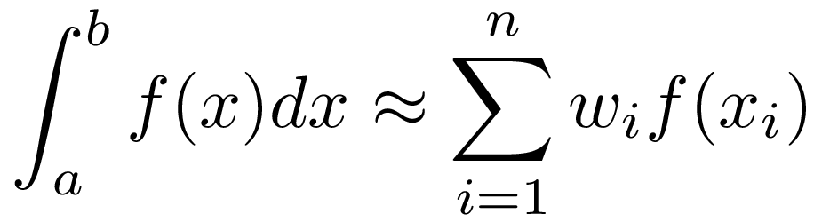

# C++ Numerical Integration

####  A C++ header-only, precision-independent library for performing numerical integration. This project is intended to be easily ustilized in conjunction with the [Eigen](http://eigen.tuxfamily.org/index.php?title=Main_Page) C++ library. Please see our [Bitbucket Repository](https://bitbucket.org/tbs1980/eigen-numerical-integration-module) for an easy way to incorporate this Numerical Integration repo as one of the unsupported submodules in your normal Eigen package.  (A declined Eigen pull request to include this feature into the Eigen library can be found [here](https://bitbucket.org/eigen/eigen/pull-requests/109/numerical-integration-module-for-eigen/diff).)

Adaptive Quadrature Numerical Integration routine in the Gauss Kronrod method capable of multiprecision calculation of Gauss Kronrod nodes/weights utilizing Laurie/Gautschi and Piessens'/Patterson's methods for the desired number of nodes/ruleset for the quadrature calculations.  Considerations have also been also paid in this effort to allow the future integration of the additional QUADPACK routines.

The original QUADPACK FORTRAN77 code can be found here:
	(http://www.netlib.org/quadpack/)

	Note: The naming of functions and variable has been adapted to favor either the associated
	journal publications' naming or simply better descriptive names over the original
	QUADPCK FORTRAN77 source code.

## Gauss-Kronrod Node/Weight Calculations

C++ functionality has been created for the calculation of Gauss-Kronrod Quadrature Weights and Abscissa based on previous work by Dirk Laurie, Walter Gautschi, and Robert Piessens', et. al.  This work has also been templated/extended to allow multiple precision by Pavel Holoborodko, Sreekumar Thaitara Balan, Mark Sauder, and Matt Beall.  Additional contribution to the Piessens' method for calculations of the nodes/weights was provided by John Burkardt.

Laurie's (a.k.a. Golub-Welsch), algorithm as implemented is outlined in the following publication:

	Calculation of Gauss-Kronrod Quadrature Rules, Dirk P. Laurie
	Mathematics of Computation, Volume 66, Number 219, July 1997, Pages 1133-1145
	S 0025-5718(97)00861-2:

Walter Gautschi's OPQ Matlab library and the work cited above can be found at:

	https://www.cs.purdue.edu/archives/2002/wxg/codes/OPQ.html,
	Orthogonal Polynomials, Quadrature, and Approximation: Computational Methods and Software (in Matlab),
	can be found at: https://www.cs.purdue.edu/homes/wxg/Madrid.pdf

Monegato method used in [quadpackcpp](http://quadpackpp.sourceforge.net/) is under development

	Some remarks on the construction of extended Gaussian quadrature rules", Giovanni Monegato,
	Math. Comp., Vol. 32 (1978) pp. 247-252. http://www.jstor.org/stable/2006272 .

The capabilities of this library have been greatly expanded through multiprecision templating via MPFRC++.  The homepage of MPFRC++ can be found here:
	(http://www.holoborodko.com/pavel/mpfr/)

## Requirements

	* [Eigen library] (http://eigen.tuxfamily.org/index.php?title=Main_Page )
	* [The GNU Multiple Precision Arithmetic Library] (https://gmplib.org/ )
	* [The GNU MPFR Library] (http://www.mpfr.org/ )
	* [MPFR C++] (http://www.holoborodko.com/pavel/mpfr/ )

Debian-based linux users can install dependencies with aptitude package manager:

	$sudo apt-get install libeigen3-dev libmpfrc++-dev

## Compilation

A compile script has been added to the top level directory, from a terminal you may simply run: ./compile.sh

(The following compilation flags must be passed)

	* -DEIGEN3_INCLUDE_DIR
	* -DGMP_ROOT
	* -DMPFR_ROOT
	* -DMPFRCPP_ROOT

	$ mkdir build
	$ cd build
	$ cmake -DEIGEN3_INCLUDE_DIR=path_to_Eigen3 -DGMP_ROOT=path_GMP_root_dir -DMPFR_ROOT=path_to_MPFR_root_dir -DMPFRCPP_ROOT=path_to_MPFRC++_root_dir  path_to_GaussKronrod
	$ make

For example,

	$ cmake ../ -DEIGEN3_INCLUDE_DIR=/arxiv/libraries/ubuntu/gcc/eigen-3.2.1/include/eigen3 -DGMP_ROOT=/arxiv/libraries/ubuntu/gcc/gmp-6.0.0 -DMPFR_ROOT=/arxiv/libraries/ubuntu/gcc/mpfr-3.1.2 -DMPFRCPP_ROOT=/arxiv/libraries/ubuntu/gcc/mpfrc++-3.5.9
	$ make

## Contributing to NumericalIntegration project

Contributions are most welcome  :smile: . Please submit a pull request or use the [issues](https://github.com/tbs1980/NumericalIntegration/issues) facility to raise any comments  :+1: .

(You can let people know that this Repository was useful to you by clicking the "Star" in the upper right of the repository home page!)

## Credits

Here's an alphabetical list: (note to contributors: do add yourself!)

name | contributions
-----|--------------
Sreekumar T. Balan | Laurie-Gautschi and Monegato methods
Matt Beall | Adaptive quadrature and Piessens method
Mark Sauder | Adaptive quadrature, Piessens method, unit-tests
